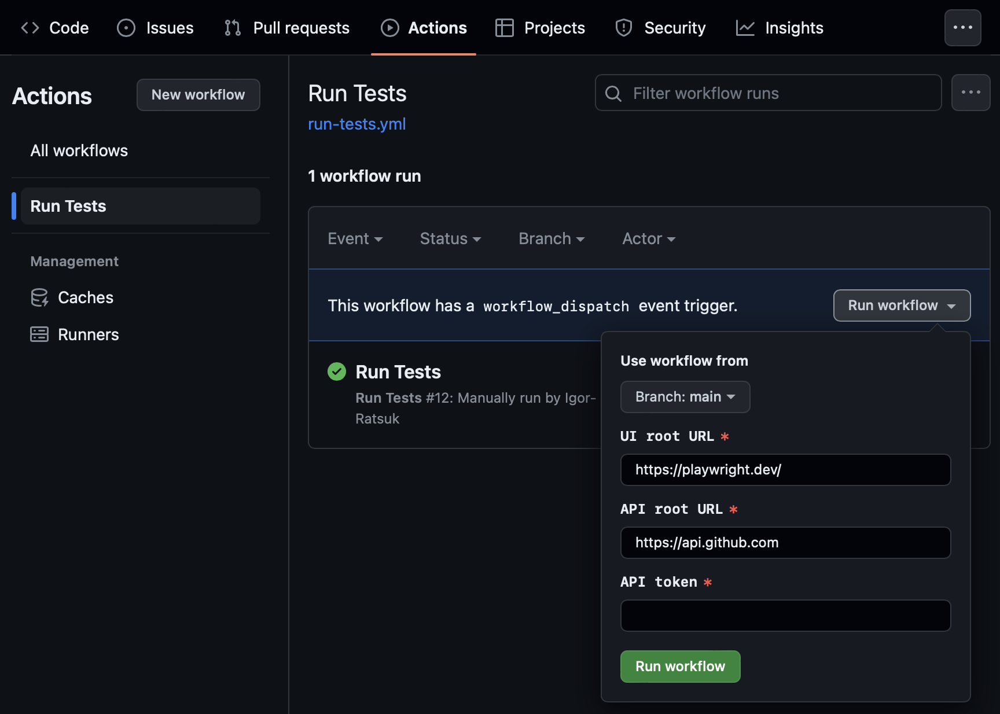
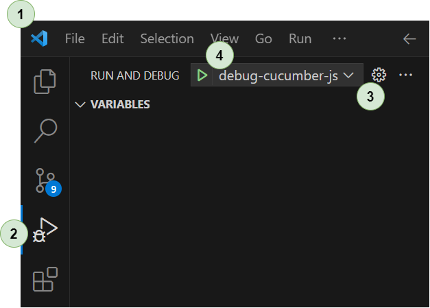

# Cucumber + TypeScript + Playwright project template

## Technology Stack

- Node.js
- PNPM
- TypeScript
- Cucumber
- Playwright
- Docker

## Repository Structure

```
cucumber-playwright-template
├─ .github                    # GitHub workflows
├─ .results                   # test results
├─ .vscode                    # Visual Studio Code settings
│  ├─ launch.json             # Visual Studio Code debugger settings
│  └─ settings.json           # Visual Studio Code editor settings
├─ config
│  └─ cucumber.json           # cucumber settings
├─ features                   # feature files
├─ src
│  ├─ data                    # test data objects
│  ├─ pages                   # page objects
│  ├─ steps                   # cucumber steps
│  └─ support                 # utils
│     ├─ configuration.ts        # test settings
│     ├─ hooks.ts             # cucumber hooks
│     ├─ macroses.ts          # macroses for Gherkin scenarios
│     └─ playwright-world.ts  # cucumber world (isolated scenario scope)
├─ .gitignore
├─ package.json
├─ pnpm-lock.yaml             # locked PNPM packages
├─ README.md
└─ tsconfig.json              # TypeScript configuration
```

## Solution Overview

This template will help to start the new test project with Cucumber, TypeScript and Playwright. Template provide capabilities for:
- creating BDD scenarios with Cucumber
- running Cucumber scenarios without compilation of .ts to .js
- mapping BDD scenarios to static and dynamic test data with macroses
- creating UI and API tests with Playwright
- using page object model
- parametrization of test runs
- running tests with GitHub Workflow
- debugging Cucumber scenarios and TypeScript code in Visual Studio Code

### Use PNPM or NPM

- use [PNPM](https://pnpm.io/) for package management

### Create BDD Scenarios

- example, `src/features/ui-tests.feature`

#### Use Custom World

- create custom world and share data between steps, example `src/support/playwright-world.ts`
- inject custom world using interfaces, example:
  ```typescript
  // src/steps/ui.steps.ts

  Given(/the user is on the root page/, async function (this: IPlaywrightContext) {
    await this.page.goto(this.configuration.ui.rootUrl);
  });
  ```

#### Define Test Data

- crearte test data, example `src/data/test-data.ts`

#### Use macroses

- use macroses for BDD scenarios parametrization
  - create data file, example: `src/data/test-data.ts`
    ```typescript
    // src/data/test-data.ts

    export const testData = {
      owner: "cucumber",
      repo: "cucumber-js"
    }
    ```
  - parametrize BDD scenarios with test data
    ```gherkin
    # features/api-tests.feature

    Scenario: Anonymous user should be able to get list of repository issues
      When the anonymous user sends GET '/repos/${{ OWNER }}/${{ REPO }}/issues'
      Then response with 200 code received
      And response body include list of issues
    ```
  - replace macroses with test data in step definition
    ```typescript
    // src/steps/api.steps.ts

    import { When, Then } from "@cucumber/cucumber";
    import { IApiContext } from "../support/playwright-world";
    import { replaceMacroses } from "../support/macroses";
    import { APIRequestContext } from "@playwright/test";

    function getApiContext(context: IApiContext, user: string): APIRequestContext {
      return user == 'anonymous' ? context.anonymousRequestContext : context.authorizedRequestContext;
    }

    When(/the (anonymous|authorized) user sends GET '(.*)'/,
      async function (this: IApiContext, user: string, path: string): Promise<void> {
        const apiRequestContext = getApiContext(this, user);
        path = replaceMacroses(path); // replace macroses
        this.lastResponse = await apiRequestContext.get(path);
      });
    ```
  - `path = replaceMacroses(path);` will convert `/repos/${{ OWNER }}/${{ REPO }}/issues` to `/repos/cucumber/cucumber-js/issues`
- macroses also can be mapped to data generators

#### Create PageObjects

```typescript
// src/pages/main.page.ts

import { Page } from '@playwright/test';
import { BasePage, LazyLocator } from './base.page';
import { ITimeouts } from '../support/configuration';

// build page objects based on BasePage
export class MainPage extends BasePage {

  // define elements
  private searchButton: LazyLocator = this.locator('button[aria-label="Search"]');
  private searchInput: LazyLocator = this.locator('input#docsearch-input');
  private searchResults: LazyLocator = this.locator('ul#docsearch-list li>a');

  constructor(page: Page, timeouts: ITimeouts = null) {
    super(page, timeouts);
  }

  // define actions
  public async clickOnSearchButton(): Promise<void> {
    await this.searchButton().click();
  }

  public async typeSearchPhraseAndPressEnter(text: string): Promise<void> {
    await this.searchInput().click();
    await this.searchInput().pressSequentially(text);
    await this.searchResults().first().waitFor();
    await this.searchInput().press('Enter');
  }
}
...
// page object usage
const mainPage = new MainPage(page);
await mainPage().clickOnSearchButton();
```

### Pass Parameters to Test Run

- parameters to test runs can be passed by environment variables
- parameters accessible through interfaces in `src/support/configuration.ts`
- use configuration with
  ```typescript
  // src/support/hooks.ts

  import { getConfiguration } from "../support/configuration";
  ...
  const config = getConfiguration();
  ```

### Run Tests with Github Workflow

- view workflow configuration `.github/workflows/run-tests.yml`
- run tests in *Github* - *Actions* - *Run Tests*
  


## How To Run Tests

### Install required tools

- Install Node.js
- Install PNPM (or NPM)
- Restore packages, run `pnpm install`
- Install Playwright and dependencies
  - run `pnpm exec playwright install` (or `npx playwright install`)
  - run `sudo pnpm exec playwright install-deps` (or `npx playwright install-deps`)
- Create `.env` file in root folder (parameters in `.env` file will be used by `src/support/configuration.ts`). Example:
  ```bash
  # .env

  UI_ROOT_URL=https://playwright.dev/ # URL to application UI
  API_ROOT_URL=https://api.github.com # URL to application API
  API_TOKEN=                          # auth token
  BROWSER_HEADLESS=false              # start browser in headless mode
  ```

### Run Tests Locally

1. Install [required tools](#preconditions)
2. Run `pnpm run test` (or `npm run test`)

### Run / Debug Tests In Visual Studio Code

1. Install [required tools](#preconditions)
2. Open project in Visual Studio Code
3. Tag scenario with `@debug` tag
4. In Visual Studio Code, navigate to `Run and Debug`
   - _debugger configured in `.vscode/launch.ł`_
5. In Run and Debug section, select `debug-pnpm-cucumber-js` configuration and run `Start Debugging`



### Run Tests In Docker

1. Install [required tools](#preconditions)
2. Install Docker
3. Run test: (note tests in Docker executed with NPM, not PNPM):
    ```bash
    docker run -i -rm -v ./:/tests -w /tests \
    mcr.microsoft.com/playwright:latest \
    /bin/bash -c "npm install && npm run test
    ```

### Run Tests with Github Workflow

1. Navigate to repository on GitHub
2. Go to Actions
3. Run a workflow `Run Tests`
    - _workflow triggered by schedule, look at `.github/workflows/run-tests.yml`_

  
